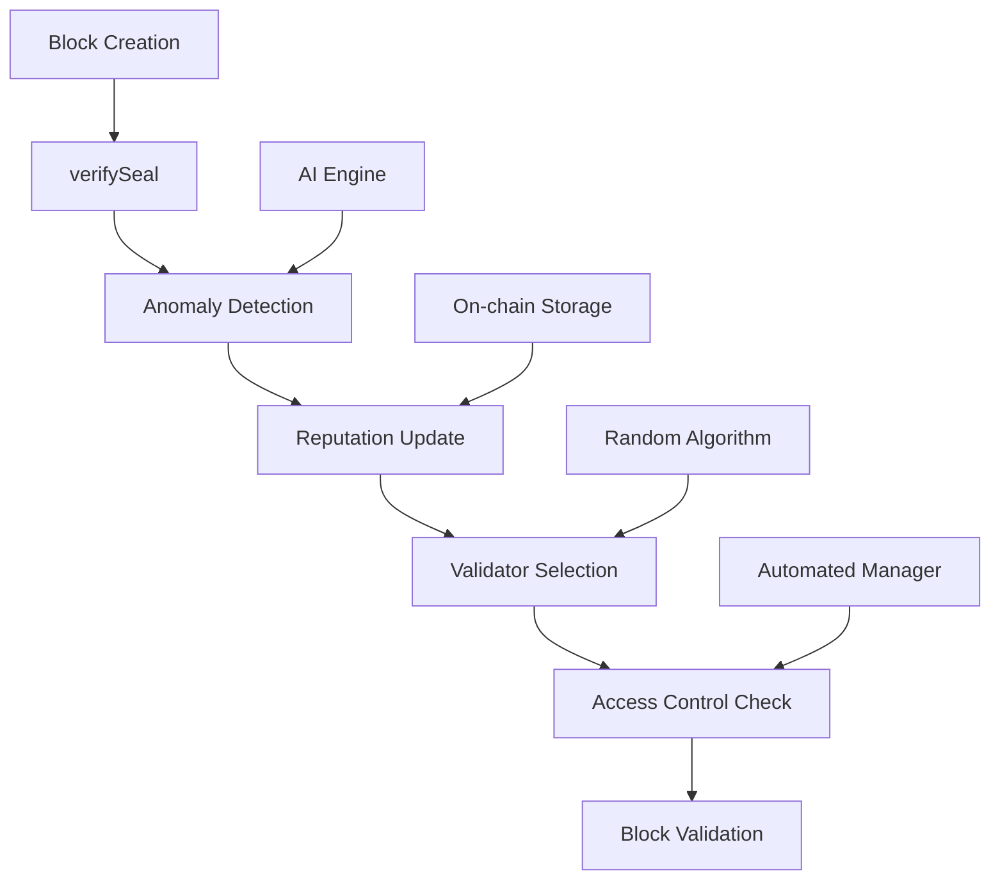

<!-- title center -->
<div align="center">
<h1 style="font-size: 36px; font-weight: bold;">Proof of Auditable & Trustworthy Conduct (POATC) </h1>
<p style="font-size: 18px; color: #666;">v1.0.0</p>
</div>

<div align="center">


<p style="font-size: 18px; color: #666;">Cơ chế đồng thuận nâng cao với tích hợp trí tuệ nhân tạo AI và bảo mật high security</p>


</div>


## **Tổng Quan Dự Án**

**POATC (Proof of Auditable & Trustworthy Conduct)** là một dự án blockchain Layer 1 được phát triển bởi **HD24 Teams**, tập trung vào việc xây dựng cơ chế đồng thuận nâng cao với tích hợp trí tuệ nhân tạo AI và các tính năng bảo mật high security.

### **Thành Tựu Chính**
- ✅ **On-chain Reputation System**: Hệ thống đánh giá danh tiếng validator minh bạch với 4 tiêu chí
- ✅ **AI-Powered Anomaly Detection**: Phát hiện 5 loại bất thường bằng trí tuệ nhân tạo
- ✅ **Automated Access Control**: Quản lý whitelist/blacklist tự động dựa trên reputation
- ✅ **2-Tier Validator Selection**: Hệ thống lựa chọn validator 2 tầng với 4 phương pháp
- ✅ **Transaction Tracing System**: Theo dõi và phân tích giao dịch chi tiết
- ✅ **Time Dynamic Adjustment**: Điều chỉnh thời gian động dựa trên network conditions


## **Tính Năng Nâng Cao**

### **1. On-chain Reputation System**
```go
type ReputationScore struct {
    Address           common.Address
    CurrentScore      float64        // Điểm tổng hiện tại
    BlockMiningScore  float64        // Điểm ký block (40%)
    UptimeScore       float64        // Điểm uptime (30%)
    ConsistencyScore  float64        // Điểm nhất quán (20%)
    PenaltyScore      float64        // Điểm phạt (10%)
    TotalBlocksMined  int
    ViolationCount    int
    IsActive          bool
}
```

**Hệ thống đánh giá đa chiều:**
- **Block Mining Performance** (40%): Khuyến khích tham gia tích cực
- **Uptime** (30%): Đánh giá độ tin cậy
- **Consistency** (20%): Đo lường tính nhất quán
- **Penalty System** (10%): Xử phạt hành vi vi phạm

### **2. AI-Powered Anomaly Detection**
```go
const (
    AnomalyNone              AnomalyType = iota
    AnomalyRapidSigning                  // Ký quá nhiều blocks
    AnomalySuspiciousPattern             // Pattern đáng ngờ
    AnomalyHighFrequency                 // Xuất hiện quá thường xuyên
    AnomalyMissingSigner                 // Validator thiếu
    AnomalyTimestampDrift                // Timestamp bất thường
)
```

**Phát hiện thông minh 5 loại anomaly:**
- **Real-time Monitoring**: Giám sát liên tục hành vi validator
- **Pattern Recognition**: Nhận diện các pattern tấn công phức tạp
- **Immediate Response**: Phản ứng ngay lập tức với các vi phạm
- **Statistical Analysis**: Phân tích thống kê để phát hiện outliers

### **3. Automated Access Control**
```go
func (c *Clique) manageWhitelistBlacklistByReputation(signer common.Address, blockNumber uint64) {
    score := c.reputationSystem.GetReputationScore(signer)
    
    // Tự động blacklist nếu reputation thấp
    if score.CurrentScore < config.LowReputationThreshold {
        c.whitelistBlacklistManager.AddToBlacklist(signer, reason, expiresAt)
    }
    
    // Tự động whitelist nếu reputation cao
    if score.CurrentScore >= config.HighReputationThreshold {
        c.whitelistBlacklistManager.AddToWhitelist(signer, reason, nil)
    }
}
```

**Quản lý tự động:**
- **Auto-blacklist**: Tự động cấm validators có reputation thấp
- **Auto-whitelist**: Tự động cho phép validators có reputation cao
- **Expiration Support**: Hỗ trợ hạn sử dụng cho các hạn chế

### **4. 2-Tier Validator Selection**
```go
type ValidatorSelectionConfig struct {
    SmallValidatorSetSize int           // Size của small validator set
    SelectionWindow       time.Duration // Thời gian selection window
    SelectionMethod       string        // "random", "stake", "reputation", "hybrid"
    
    // Hybrid selection weights
    StakeWeight      float64 // Trọng số stake (0.4)
    ReputationWeight float64 // Trọng số reputation (0.4)
    RandomWeight     float64 // Trọng số random (0.2)
}
```

**Hệ thống lựa chọn 2 tầng:**
- **Tier 1**: Chọn small validator set từ tất cả validators
- **Tier 2**: Random selection từ small set
- **4 Phương pháp**: Random, Stake-based, Reputation-based, Hybrid
- **Fairness**: Đảm bảo tính công bằng và không dự đoán được

### **5. Advanced Transaction Tracing System**
```go
const (
    TraceLevelOff TraceLevel = iota
    TraceLevelBasic
    TraceLevelDetailed
    TraceLevelVerbose
)

const (
    TraceEventRandomPOA          TraceEventType = "random_poa"
    TraceEventLeaderSelection    TraceEventType = "leader_selection"
    TraceEventBlockSigning       TraceEventType = "block_signing"
    TraceEventAnomalyDetection   TraceEventType = "anomaly_detection"
    TraceEventReputationUpdate   TraceEventType = "reputation_update"
    TraceEventValidatorSelection TraceEventType = "validator_selection"
    TraceEventTimeDynamic        TraceEventType = "time_dynamic"
)
```

**Hệ thống tracing toàn diện:**
- **4 Trace Levels**: Off, Basic, Detailed, Verbose
- **13 Trace Event Types**: Bao gồm tất cả hoạt động consensus
- **Merkle Tree Support**: Đảm bảo tính toàn vẹn dữ liệu
- **Debug Support**: Hỗ trợ debug và phân tích chi tiết
- **Performance Analysis**: Phân tích hiệu suất real-time

### **6. Time Dynamic Adjustment**
```go
type TimeDynamicConfig struct {
    // Dynamic Block Time
    EnableDynamicBlockTime bool          `json:"enable_dynamic_block_time"`
    BaseBlockTime         time.Duration `json:"base_block_time"`         // 15 seconds
    MinBlockTime          time.Duration `json:"min_block_time"`          // 5 seconds
    MaxBlockTime          time.Duration `json:"max_block_time"`          // 30 seconds
    
    // Dynamic Validator Selection
    EnableDynamicValidatorSelection bool          `json:"enable_dynamic_validator_selection"`
    ValidatorSelectionInterval      time.Duration `json:"validator_selection_interval"` // 10 minutes
    
    // Dynamic Reputation Decay
    EnableDynamicReputationDecay bool          `json:"enable_dynamic_reputation_decay"`
    ReputationDecayRate          float64       `json:"reputation_decay_rate"`          // Per hour decay rate
}
```

**Điều chỉnh thời gian động:**
- **Adaptive Block Time**: 5-30 giây tùy theo network load
- **Dynamic Validator Selection**: Thay đổi interval dựa trên performance
- **Reputation Decay**: Decay rate động theo thời gian
- **Real-time Monitoring**: Giám sát và điều chỉnh liên tục

---

## **Kiến Trúc Hệ Thống**



### **Luồng Xử Lý Block**
1. **Block Creation**: Validator tạo block mới
2. **Anomaly Detection**: AI phát hiện hành vi bất thường (5 loại)
3. **Reputation Update**: Cập nhật điểm danh tiếng (4 tiêu chí)
4. **Validator Selection**: Chọn validator cho block tiếp theo (2-tier)
5. **Access Control**: Kiểm tra whitelist/blacklist tự động
6. **Transaction Tracing**: Trace và phân tích transactions (4 levels)
7. **Time Adjustment**: Điều chỉnh thời gian động (5-30s)
8. **Merkle Tree**: Tính toán merkle root cho trace events
9. **Block Validation**: Hoàn tất quá trình xác thực

---

## **Cài Đặt và Triển Khai**

### **Yêu Cầu Hệ Thống**
- **Go**: 1.19+ 
- **RAM**: 8GB+ (khuyến nghị 16GB)
- **Storage**: 100GB+ SSD
- **Network**: 25+ Mbps

### **Cài Đặt Nhanh**
```bash
# Clone repository
git clone https://github.com/haidang24/POATC.git
cd POATC

# Build executable
go build -o hdchain.exe ./cmd/geth

# Khởi tạo testnet
mkdir testnet && cd testnet
cp ../testnet/genesis.json .

# Khởi động nodes với POATC consensus
./hdchain.exe --datadir node1 --port 30303 --rpc --rpcport 8545 --mine --consensus poatc
./hdchain.exe --datadir node2 --port 30304 --rpc --rpcport 8549 --mine --consensus poatc
```

### **Khởi Động Explorer**
```bash
cd testnet/explorer
python server.py 8080
# Mở: http://localhost:8080
```

---

## **Hiệu Suất và Bảo Mật**

### **Performance Metrics**
| Metric | Value | Improvement |
|--------|-------|-------------|
| Block Time | 5-30 seconds | Dynamic adjustment |
| TPS | 1000+ | Optimized với tracing |
| Memory Usage | +20% | AI features overhead |
| CPU Usage | +10% | Anomaly detection |
| Anomaly Detection | <100ms | Real-time response |
| Reputation Update | <50ms | Fast scoring |
| Trace Processing | <200ms | Merkle tree calculation |
| Validator Selection | <150ms | 2-tier algorithm |

### **Security Features**
- **Multi-layer Security**: Anomaly detection + Reputation + Access control + Tracing
- **Tamper-resistant**: On-chain storage với cryptographic verification
- **Real-time Monitoring**: Continuous monitoring với immediate response
- **Automated Recovery**: Self-healing mechanisms
- **Merkle Tree Integrity**: Đảm bảo tính toàn vẹn trace data
- **2-Tier Validation**: Double validation cho validator selection
- **Dynamic Security**: Adaptive security parameters

---

## **Ứng Dụng Thực Tế**

### **Enterprise Blockchain**
- **Consortium Networks**: Phù hợp cho các mạng liên minh
- **Supply Chain**: Theo dõi và xác thực chuỗi cung ứng
- **Financial Services**: Ứng dụng tài chính với bảo mật cao

### **Public Networks**
- **DeFi Platforms**: Nền tảng tài chính phi tập trung
- **NFT Marketplaces**: Thị trường NFT với tính công bằng cao
- **Gaming Platforms**: Nền tảng game với anti-cheat mechanisms

---

## **Roadmap**

### **Q1 2025**
- **Random Selection Algorithm**
- **On-chain Reputation System** (4 tiêu chí)
- **AI Anomaly Detection** (5 loại)
- **2-Tier Validator Selection** (4 phương pháp)
- **Advanced Transaction Tracing** (4 levels)
- **Time Dynamic Adjustment** (5-30s)
- **Professional Explorer**

### **Q2 2025**
- **Machine Learning Enhancement cho Anomaly Detection**
- **Cross-chain Integration**
- **Advanced Analytics Dashboard**
- **Mobile App Development**
- **Merkle Tree Optimization**

### **Q3-Q4 2025**
- **Enterprise Solutions**
- **API Marketplace**
- **Community Governance**
- **Global Expansion**
- **Advanced AI Features**

---

### **Community**
- **Discord**: [HaiDang Community](https://discord.gg/haidang)
- **Email**: maidang24112004@gmail.com

---

## **Đội Ngũ Phát Triển**

### **HD24 Teams**
- **Developer**: HaiDang - Blockchain Developer

---

## **Liên Hệ**

<div align="center">

**HaiDang - Blockchain Developer**

**Email**: maidang24112004@gmail.com  

---

*Copyright HD24Teams - HD24Security Lab - POATC Consensus Engine*

</div>
